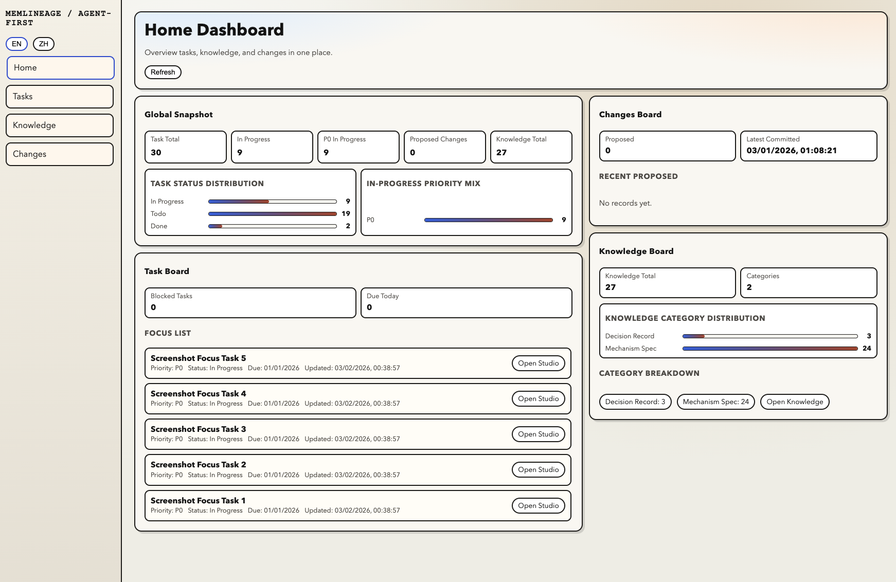

# MemLineage

[](LICENSE)
[](https://github.com/zhuamber370/memlineage/issues)
[](https://github.com/zhuamber370/memlineage/commits/main)

MemLineage is a shared workspace for solo developers working with agents.
Humans use the web UI to manage tasks and knowledge directly, while agents access the same data through skills.
This removes simple CRUD from chat, cuts unnecessary token usage, and keeps shared context visible outside conversation history.
Current product focus is `tasks + knowledge`, with review and integration tools around that shared workspace.

Quick links:
- Run locally: [Quickstart](#quickstart)
- Connect Codex or OpenClaw: [Connect Your Agent](#connect-your-agent)
- Review the current web surfaces: [What You Can Do Today](#what-you-can-do-today)
- Check the integration contract: [INTEGRATION.md](INTEGRATION.md)
- Inspect the agent skill: [skills/memlineage/SKILL.md](skills/memlineage/SKILL.md)

## Why MemLineage

If you work with agents every day, a lot of changes are too small to justify a chat loop:

- a task title needs a quick edit
- a knowledge entry needs a category change
- you want to browse what exists before deciding what to ask the agent to do

Doing all of that through chat costs time, burns tokens, and makes simple state harder to inspect.

MemLineage gives you a shared workspace instead:

- use the web UI for fast human CRUD
- use skills when you want the agent to read or write the same data
- keep tasks and knowledge in one place that both sides can maintain

## What You Can Do Today

- **Manage tasks on `/tasks`**: create, filter, batch update, archive, and move into the execution studio when work starts
- **Maintain knowledge on `/knowledge`**: search, categorize, edit, archive, and delete entries in a dedicated CRUD workspace
- **Review agent-originated writes on `/changes`**: inspect diffs, commit or reject proposals, and undo the last commit
- **Operate local skill runtimes on `/skills`**: detect, install, enable, disable, update, and health-check MemLineage for Codex and OpenClaw
- **Monitor the workspace on `/`**: see task/knowledge snapshots and run local database backup/restore actions

The surrounding pages support that same workflow instead of replacing it: they help you review agent writes, manage local skill installs, and keep the workspace visible without relying on chat history.

## UI Preview

> Screenshots use synthetic test data.




## How Human + Agent Collaboration Works

1. **Human path:** use the web UI for direct CRUD and browsing.
2. **Agent path:** enable the MemLineage skill so your agent can read and write the same backend.
3. **Shared state:** both paths operate on the same local-first workspace data.
4. **Safe writes when needed:** agent writes can go through `dry-run -> diff -> review -> commit -> undo`.

The goal is not to force every action through governance.
It is to keep simple operations cheap, while still giving you review tools for agent-originated changes.

## Current Scope

The current repository already includes a working web app, backend API, and bundled agent skill.
This is the present-day surface area:

### Web UI

- `/`
  - home dashboard with task, knowledge, news, and change summaries
  - database backup and restore actions
- `/tasks`
  - task CRUD workspace
  - execution studio with route graph and node logs
- `/knowledge`
  - knowledge CRUD workspace backed by `/api/v1/knowledge`
  - category model: `ops_manual | mechanism_spec | decision_record`
- `/changes`
  - proposal review with diff inspection
  - commit, reject, and undo flows
- `/skills`
  - local runtime management for the MemLineage skill
  - supports Codex and OpenClaw on the same machine
- `/news`
  - structured news tracking workspace

### Backend API

The FastAPI backend currently exposes:

- task APIs
- knowledge APIs
- change review and undo APIs
- skill management APIs
- route graph and execution log APIs
- database backup/restore APIs

See [backend/README.md](backend/README.md) for the synced API surface.

### Agent Skill

The bundled skill lives at [skills/memlineage/SKILL.md](skills/memlineage/SKILL.md).
It routes natural-language requests for tasks, knowledge, changes, audit, and related workspace reads/writes into the MemLineage backend.

## Quickstart

### 1) Clone

```bash
git clone https://github.com/zhuamber370/memlineage.git
cd memlineage
```

### 2) Configure env

```bash
cp .env.example .env
cp .env frontend/.env.local
```

Default local mode:
- `AFKMS_DB_BACKEND=sqlite`
- `AFKMS_REQUIRE_AUTH=false`

### 3) Run backend

```bash
cd backend
python3 -m venv .venv
source .venv/bin/activate
pip install -r requirements.txt
python3 -m uvicorn src.app:app --reload --port 8000
```

### 4) Run frontend

```bash
cd frontend
npm install
npm run dev
```

### 5) Verify

- Backend: <http://127.0.0.1:8000/health>
- Frontend: <http://127.0.0.1:3000>

Additional runtime details:
- [backend/README.md](backend/README.md)
- [frontend/README.md](frontend/README.md)

## Connect Your Agent

MemLineage currently supports local skill workflows for **Codex** and **OpenClaw**.

### Recommended path: use the `/skills` UI

After the app is running:

- open <http://127.0.0.1:3000/skills>
- choose `Codex` or `OpenClaw`
- click `Detect`
- if detection fails, save a manual runtime path and detect again
- install / enable / update the skill from the same page

Constraint:
- the MemLineage backend and the target agent runtime must be on the same machine

### Script path

Install for Codex:

```bash
bash scripts/install_codex_memlineage_skill.sh
```

Install for OpenClaw:

```bash
bash scripts/install_openclaw_memlineage_skill.sh
```

Uninstall:

```bash
bash scripts/uninstall_codex_memlineage_skill.sh
bash scripts/uninstall_openclaw_memlineage_skill.sh
```

### Runtime env

Set these where the agent runtime actually runs:

```bash
export KMS_BASE_URL="http://127.0.0.1:8000"
export KMS_API_KEY="dev-api-key"
```

Notes:

- If `AFKMS_REQUIRE_AUTH=false`, `KMS_API_KEY` can be any non-empty placeholder.
- If `AFKMS_REQUIRE_AUTH=true`, `KMS_API_KEY` must match the backend key.
- Installing the skill does not inject env vars into an already running runtime process.
- After Codex install, start a new session.
- After OpenClaw install, restart the gateway if needed.

More integration details:
- [INTEGRATION.md](INTEGRATION.md)
- [skill/README.md](skill/README.md)

## Example Agent Requests

These examples work after the MemLineage skill is available to the runtime.

Read examples:

```text
What should I prioritize today? Show my top tasks with blocked status and due dates.
```

```text
Show recent knowledge updates related to onboarding and release work.
```

```text
For task "Release v0.1.2", where am I in the execution graph right now?
```

Write examples:

```text
Create a task proposal for "Prepare v0.1.3 changelog", priority P1, due this week. Do not commit yet.
```

```text
Create a knowledge proposal titled "Release checklist" under ops_manual. Keep it as a proposal only.
```

Review example:

```text
Show me the latest proposed change and summarize its impact before I commit it.
```

## Docs

- Docs index: [docs/README.md](docs/README.md)
- Backend details: [backend/README.md](backend/README.md)
- Frontend details: [frontend/README.md](frontend/README.md)
- Integration guide: [INTEGRATION.md](INTEGRATION.md)
- Runtime/API contract: [docs/guides/agent-api-surface.md](docs/guides/agent-api-surface.md)
- Safe-to-write checklist: [docs/guides/safe-to-write-checklist.md](docs/guides/safe-to-write-checklist.md)
- Proof pack: [docs/proof/README.md](docs/proof/README.md)

## Contributing

- Start guide: [CONTRIBUTING.md](CONTRIBUTING.md)
- Contributor dev setup: [docs/contributing/dev-setup.md](docs/contributing/dev-setup.md)
- Good first issues: <https://github.com/zhuamber370/memlineage/issues?q=is%3Aissue+is%3Aopen+label%3A%22good+first+issue%22>

## Security

Please follow [SECURITY.md](SECURITY.md) for responsible disclosure.

## License

Apache-2.0. See [LICENSE](LICENSE).
